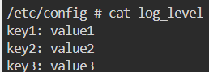

operations：运维人员 DevOps

调度器：1.预选【哪些Node满足】2.优选【哪个Node最适合】

控制器管理器[做冗余备份，3个] 监控->控制器 确保监控：在本地loop

pod：内部 共享网络，共享volumes。容器puse、main、sidecar 

### 使用kubeadm进行集群升级

1. 升级kubeadm
2. 查看kubeadm
3. 

### ingress

1. 先把应用服务部署

   ```yaml
   # myweb-deploy
   apiVersion: apps/v1
   kind: Deployment
   metadata:
     name: myweb
     labels:
       app: myweb
       name: myweb
   spec:
     replicas: 2
     selector:
       matchLabels:
         app: myweb
     template:
       metadata:
         labels:
           app: myweb
       spec:
         containers:
         - image: kubeguide/tomcat-app:v1
           name: myweb
           ports:
           - containerPort: 8080
           env:
           - name: MYSQL_SERVICE_HOST
             value: mysql
   ---
   kind: Service
   apiVersion: v1
   metadata:
     name: myweb
   spec:
     selector:
       app: myweb
     type: NodePort # 在任意Node
     ports:
     - port: 8080
     	
       nodePort: 30001
   
   ```

### 测试

1. probe 探针 startup、liveness、readiness

创建一个pod，默认是没有探针的。

创建一个deploy，默认是没有探针的。

那是如何实现监控多个实例的资源对象的？

探针提供了更细粒度的健康检查和状态管理能力，适用于需要定期检查容器内部健康状态的应用场景。而在没有探针的情况下，Kubernetes 通过监控容器的启动和退出状态、以及与容器运行时的交互，来判断 Pod 的状态。探针使 Kubernetes 能够更灵活和智能地管理容器的生命周期，而基本的状态监控功能在没有探针时也能确保 Pod 的基本可用性。

>**容器的启动和退出状态**：
>
>- **容器的启动**：当 Pod 中的容器启动成功并进入 `Running` 状态时，Kubernetes 认为容器正在正常运行。
>- **容器的退出状态**：如果容器意外退出（崩溃），Kubernetes 通过监控容器的退出状态（如 `CrashLoopBackOff`）来判断 Pod 是否不健康。
>
>**容器的生命周期事件**：
>
>- Kubernetes 通过 `kubelet` 定期与容器运行时交互，获取容器的状态，并上报给 API 服务器。
>- Kubernetes 使用这些状态更新来判断 Pod 的整体状态，并根据需要进行处理（如重新调度、重启等）。
>
>**Pod 状态管理**：
>
>Kubernetes 通过控制器（如 ReplicaSet 和 Deployment 控制器）持续监控 Pod 的状态。控制器从 `kubelet` 和 API 服务器获取 Pod 的状态信息，判断 Pod 是否处于正常的生命周期状态（如 `Pending`、`Running`、`Succeeded`、`Failed` 等）。
>
>在没有探针的情况下，Pod 的 `Ready` 状态主要由容器的启动状态决定。当容器处于 `Running` 状态时，Kubernetes 会认为 Pod 是可用的。

2. configmap: 

* 创建configmap

```yaml
# 存放 key-value 的pod
apiVersion: v1
kind: ConfigMap
metadata:
  name: myconfigmap
  labels:
    app: myapplication
data:
  my-key: my-value
  my-key2: my-value2
  # 使用 | 来表示后续的内容是一个多行字符串。这在存储复杂的文本内容时非常方便，例如配置文件、脚本等。
  config-file: |
    key1: value1
    key2: value2
    key3: value3
  my-key3: my-value3
```

* 通过env在容器中使用。使用 可以在 env | grep MY_KEY 可以查看到  MY_KEY=key1: value1

  > kubectl exec -it configmap-pod -c test -- ls /app
  >
  > 当你使用 ConfigMap 数据作为环境变量时，Kubernetes 只会将 ConfigMap 中的单行数据直接映射到环境变量中。每个环境变量需要有一个单独的键值对，如果 ConfigMap 中的数据是多行的，那么这些行将不会被拆分成独立的环境变量。这样，只有第一行的内容会被设置到环境变量中。

  ```yaml
  apiVersion: v1
  kind: Pod
  metadata:
    name: configmap-pod
  spec:
    containers:
    - name: test
      image: busybox:1.28
      command: ['sh', '-c', 'echo "The app is running!" && tail -f /dev/null']
      env:
      - name: MY_KEY
        valueFrom:
          configMapKeyRef:
            name: myconfigmap
            key: config-file
  ```

* 通过卷挂载到容器内某个文件内   kubectl exec -it configmap-pod -c test -- sh



  ```yaml
  # 键值对配置
  apiVersion: v1
  kind: Pod
  metadata:
    name: configmap-pod
  spec:
    containers:
    - name: test
      image: busybox:1.28
      command: ['sh', '-c', 'echo "The app is running!" && tail -f /dev/null']
      volumeMounts:
      - name: config-vol
        mountPath: /etc/config
    volumes:
    - name: config-vol
      configMap:
        name: myconfigmap
        items:
        - key: config-file
          path: log_level # 容器内的文件名，在/etc/config/log_level文件下存储了 configmap中key为log_level的value值。
  ```

  

