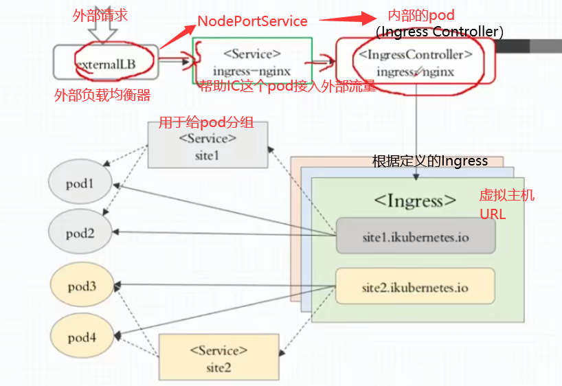

type: LoadBalancer 的service的使用
在 Kubernetes 中，当你创建一个 `type: LoadBalancer` 的 `Service`，Kubernetes 会与底层的公有云平台集成，自动配置一个公有云的负载均衡器，将外部流量引导到集群内部的服务上。

### 连接公有云的过程
1. **服务创建**:
   - 当你在 Kubernetes 集群中创建一个 `LoadBalancer` 类型的 `Service` 时，Kubernetes 控制器会检测到这一配置，并将其转发给集群的云控制器管理器（Cloud Controller Manager）。

2. **云控制器管理器（Cloud Controller Manager）**:
   - 云控制器管理器是一个与公有云平台（如 AWS、GCP、Azure 等）集成的组件。它根据 Service 的配置，在云平台上自动创建一个对应的负载均衡器。
   - 该负载均衡器通常是云平台原生的，例如：
     - **AWS**: 创建一个 ELB（Elastic Load Balancer）
     - **GCP**: 创建一个 Google Cloud Load Balancer
     - **Azure**: 创建一个 Azure Load Balancer

3. **配置负载均衡器**:
   - 云平台会为这个负载均衡器分配一个公共 IP 地址，并将该地址与 Kubernetes 集群中的相应节点 IP 地址或直接与 Pod 绑定。
   - 负载均衡器会将外部流量根据规则分发到 Kubernetes 集群内部运行的相应 Pods 上。

4. **更新 Service 状态**:
   - 当公有云负载均衡器创建完成后，Kubernetes 会更新 `Service` 的状态，并在 `Service` 的 `status.loadBalancer.ingress` 字段中记录该负载均衡器的公共 IP 地址。
   - 你可以通过 `kubectl get service` 查看这个 IP 地址，然后通过这个 IP 访问 Kubernetes 集群中的服务。

### 主要优势
- **自动化配置**: Kubernetes 会自动管理负载均衡器的创建、配置和删除，无需手动操作。
- **动态缩放**: 当 `Service` 背后的 Pods 发生变化（如扩展或收缩）时，负载均衡器会自动调整流量分配规则。
- **云平台集成**: `LoadBalancer` 类型的 `Service` 利用云平台的基础设施，实现了与外部世界的无缝连接。

### 公有云平台支持的负载均衡器类型
- **AWS**: 支持经典负载均衡器 (Classic Load Balancer) 和网络负载均衡器 (Network Load Balancer)。
- **GCP**: 支持区域负载均衡器 (Regional Load Balancer)。
- **Azure**: 支持标准负载均衡器 (Standard Load Balancer)。

通过这种方式，Kubernetes 实现了将集群内部服务公开给外部用户，并确保流量能够被可靠地转发到正确的 Pod 上。

使用ingress后的外部访问集群内部pod的流程

其中可以选择将ingress controller设置成共享节点【hostnetwork】和DaemoSet运行在特定节点上，进而可以省去nodeport的Service这个帮助IC接入外部流量这个服务。

hostnetwork

将 Pod 设置为使用 `hostNetwork` 会让 Pod 直接使用所在节点的网络栈。这意味着 Pod 中的容器将与主机共享 IP 地址和网络接口，而不是使用 Kubernetes 通常分配的独立 Pod 网络。这种配置会产生以下效果：

### 1. **共享节点的 IP 地址**
   - Pod 中的容器将直接使用节点（主机）的 IP 地址。这意味着容器的所有网络通信都将直接通过节点的网络接口进行。
   - 由于共享 IP 地址，如果在多个 Pod 中使用相同的端口号，会导致端口冲突问题。

### 2. **不经过 Kubernetes 内部网络**
   - 在常规的 Kubernetes 网络模型中，Pod 通常有自己独立的 IP 地址，并通过 Kubernetes 的虚拟网络（如 Flannel、Calico 等）进行通信。
   - 使用 `hostNetwork` 后，Pod 不再使用 Kubernetes 内部网络，而是直接通过主机的网络接口进行通信，绕过了 Kubernetes 网络插件和网络策略的管理。

### 3. **访问主机上的服务**
   - 使用 `hostNetwork` 的 Pod 可以直接访问主机上运行的本地服务（如守护进程、系统服务等），因为它们共享相同的网络命名空间。
   - 这对于需要与主机上服务进行紧密集成的应用非常有用，比如需要访问本地主机上的监控代理或日志收集服务。

### 4. **暴露 Pod 中的端口**
   - 如果 Pod 中的容器暴露了某个端口，那么这个端口会在主机上直接可用。任何访问节点 IP 地址和该端口的请求都会直接进入 Pod 中的容器。
   - 例如，如果一个 `hostNetwork` 的 Pod 在端口 8080 上运行一个服务，那么访问节点的 IP 地址和 8080 端口就会直接到达该服务。

### 5. **提升网络性能**
   - 因为流量不再经过 Kubernetes 网络插件的处理层，使用 `hostNetwork` 可以减少网络通信中的开销，可能会提升网络性能。这在高性能或低延迟要求的应用中可能会有帮助。

### 6. **可能的安全隐患**
   - 使用 `hostNetwork` 后，Pod 获得了对节点网络栈的更高权限，可能增加了潜在的安全风险。例如，如果一个 Pod 被攻破，攻击者可能能够访问到主机的网络接口或主机上其他 Pod 的网络流量。
   - 因此，在使用 `hostNetwork` 时需要格外注意安全策略，确保只有信任的应用使用这个功能。

### 7. **集群网络可见性**
   - 因为 `hostNetwork` 的 Pod 使用主机的网络命名空间，这些 Pod 不会受到 Kubernetes 网络策略的限制。这可能会导致网络可见性问题，因为 Pod 可以绕过网络策略直接与主机和其他 Pod 通信。

### 总结
设置 `hostNetwork: true` 会让 Pod 共享节点的网络栈，使得 Pod 的容器与主机共享 IP 地址和端口空间。这种配置可能会提高网络性能，并允许 Pod 访问主机上的服务，但同时也会引入端口冲突的风险，增加安全隐患，并可能导致网络策略失效。因此，`hostNetwork` 通常用于特定需要直接访问主机网络的场景，并且在使用时需要仔细评估其安全性和网络影响。

curl --resolve mywebsite.com:30137:172.30.2.2 http://mywebsite.com/demo/
