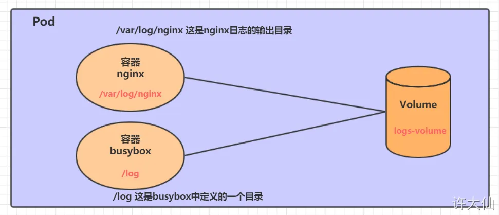
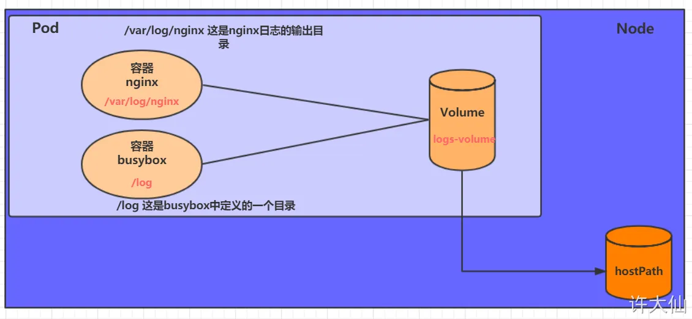
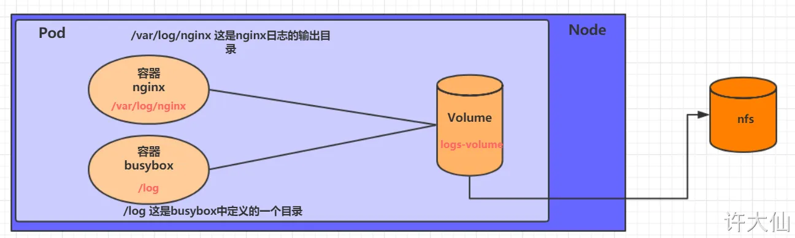

存储

### EmptyDir

1. EmptyDir是Host上的一个空目录，无需手动指定宿主机的对应目录文件。



pod被分配到node时创建，pod销毁时会被永久删除。 docker匿名卷

作用于：1.临时空间。2.容器间文件共享

```yaml
apiVersion: v1
kind: Pod
metadata:
  name: myPod
  labels:
    role: test
spec:
  containers:
    - name: nginx
      image: nginx:1.17.1
      imagePullPolicy: IfNotPresent
      ports:
        - name: nginx
          containerPort: 80
          protocol: TCP
      volumeMounts:
        - name: myVolume
          mountPath: /var/log/nginx
    - name: busybox
      image: busybox:1.30
      imagePullPolicy: IfNotPresent
      command: ["/bin/sh","-c","tail -f /logs/access.log"] # 初始命令，动态读取指定文件
      volumeMounts:
        - name: myVolume
          mountPath: /logs
  volumes:
    - name: myVolume
      emptyDir: {} # 此时代表使用默认
        # medium: "Memory" 默认为磁盘，Memory为内存
        # sizeLimit: "1Gi" # 只有当为Memory时有用
  restartPolicy: Always
```

### HostPath
主机中的实际目录。工作流程：pod挂载的目录是在pod创建时的实际Node节点。



```yaml
apiVersion: v1
kind: Pod
metadata:
  name: my-pod
  labels:
    role: test
spec:
  containers:
    - name: nginx
      image: nginx:1.17.1
      imagePullPolicy: IfNotPresent
      ports:
        - name: nginx
          containerPort: 80
          protocol: TCP
      volumeMounts:
        - name: my-volume
          mountPath: /var/log/nginx
    - name: busybox
      image: busybox:1.30
      imagePullPolicy: IfNotPresent
      command: ["/bin/sh","-c","tail -f /logs/access.log"] # 初始命令，动态读取指定文件
      volumeMounts:
        - name: my-volume
          mountPath: /logs
  volumes:
    - name: my-volume
      hostPath:
        path: /root/logs
        type: DirectoryOrCreate # 目录存在就使用，不存在就先创建再使用
```

`type` 选项用于指定要挂载的主机路径的类型。它是一个可选字段，但当你指定时，它确保了挂载的路径符合你期望的类型。以下是 `type` 的可选值：

1. **`Empty`**: 允许任何类型的文件系统对象（默认值）。如果你不指定 `type`，就会默认使用 `Empty`，即没有进行任何类型检查。
2. **`DirectoryOrCreate`**: 如果路径存在且是一个目录，则使用这个目录；如果路径不存在，则创建一个新的目录。
3. **`Directory`**: 路径必须存在且是一个目录。如果路径不存在，Pod 将无法启动。
4. **`FileOrCreate`**: 如果路径存在且是一个文件，则使用这个文件；如果路径不存在，则创建一个新的空文件。
5. **`File`**: 路径必须存在且是一个文件。如果路径不存在或不是文件，Pod 将无法启动。
6. **`Socket`**: 路径必须存在且是一个 UNIX 套接字（socket）。如果路径不存在或类型不对，Pod 将无法启动。
7. **`CharDevice`**: 路径必须存在且是一个字符设备。如果路径不存在或类型不对，Pod 将无法启动。
8. **`BlockDevice`**: 路径必须存在且是一个块设备。如果路径不存在或类型不对，Pod 将无法启动。

### NFS

pod的节点出现问题时，pod转移到其他节点时Hostpath就会出现问题

NFS是一个网络文件存储系统，可以搭建一台NFS服务器，然后将pod中的存储直接连接到NFS系统上，这样无论Pod如何转移，只要Node和NFS的对接没有问题，数据就可以成功访问。



先部署一台nfs服务器

​	安装nfs服务器

1. yum install -y nfs-utils rpcbind

​	准备一个共享目录

2. mkdir -pv /root/data/nfs

   将共享目录以读写权限暴露给网段中的所有主机

3. vim /etc/exports

```yaml
/root/data/nfs 192.168.18.0/24(rw,no_root_squash)
```

4. 修改权限

   chmod 777 -R /root/data/nfs

5. 加载配置

   exportfs -r

​	启动nfs服务

```sh
systemctl start rpcbind
systemctl enable rpcbind
systemctl start nfs
systemctl enable nfs
```

检查是否挂载成功

```s
showmount -e 192.168.18.100
```


在其他节点上也安装服务

```yaml
# 在Node节点上安装NFS服务，不需要启动
yum -y install nfs-utils
```

测试node节点是否挂载成功

```sh
showmount -e 192.168.18.100
```

高可用备份方式，在所有节点执行如下命令

```sh
mount -t  nfs 192.168.18.100:/root/data/nfs /mnt
```

创建pod

```yaml
apiVersion: v1
kind: Pod
metadata:
  name: my-pod
  labels:
    role: test
spec:
  containers:
    - name: nginx
      image: nginx:1.17.1
      imagePullPolicy: IfNotPresent
      ports:
        - name: nginx
          containerPort: 80
          protocol: TCP
      volumeMounts:
        - name: my-volume
          mountPath: /var/log/nginx
    - name: busybox
      image: busybox:1.30
      imagePullPolicy: IfNotPresent
      command: ["/bin/sh","-c","tail -f /logs/access.log"] # 初始命令，动态读取指定文件
      volumeMounts:
        - name: my-volume
          mountPath: /logs
  volumes:
    - name: my-volume
      nfs:
        server: 192.168.18.100 # NFS服务器地址
        path: /root/data/nfs # 共享文件路径
```

### PV PVC SC

用户声明pvc，sc通过pvc动态创建pv，绑定PV和PVC供pod使用。

```yaml
apiVersion: v1
kind: Pod
metadata:
  name: my-pod
  labels:
    role: test
spec:
  containers:
    - name: nginx
      image: nginx:1.17.1
      imagePullPolicy: IfNotPresent
      ports:
        - name: nginx
          containerPort: 80
          protocol: TCP
      volumeMounts:
        - name: my-volume
          mountPath: /var/log/nginx
    - name: busybox
      image: busybox:1.30
      imagePullPolicy: IfNotPresent
      command: ["/bin/sh","-c","tail -f /logs/access.log"] # 初始命令，动态读取指定文件
      volumeMounts:
        - name: my-volume
          mountPath: /logs
  volumes:
    - name: my-volume
      persistentVolumeClaim:
        claimName: my-pvc
        readOnly: false
---
kind: PersistentVolumeClaim
apiVersion: v1
metadata:
  name: my-pvc
spec:
  accessModes:
    - ReadWriteOnce
  resources:
    requests:
      storage: 2Gi
```

#### pvc的配置


#### pv的配置


#### sc的配置


### Go

函数： 

```go
func name(parameter-list) (result-list){
    body
}
```

方法：

```go
// 函数
func Distance(p, q Point) float64{
    return math.Hypot(q.X-p.X, q.Y-p.Y)
}
// 方法
func (p Point) Distance(q Point) float64{
    return math.Hypot(q.X-p.X, q.Y-p.Y)
}
```

接口:当看到一个接口类型的值时，唯一知道的就是可以**通过它的方法来做什么**。
