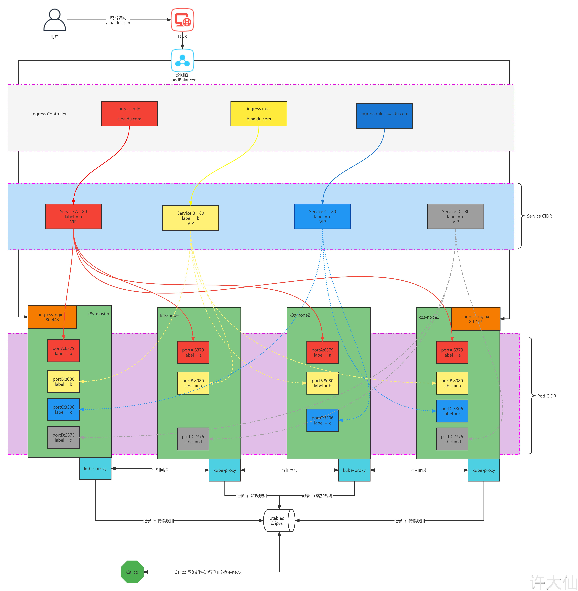
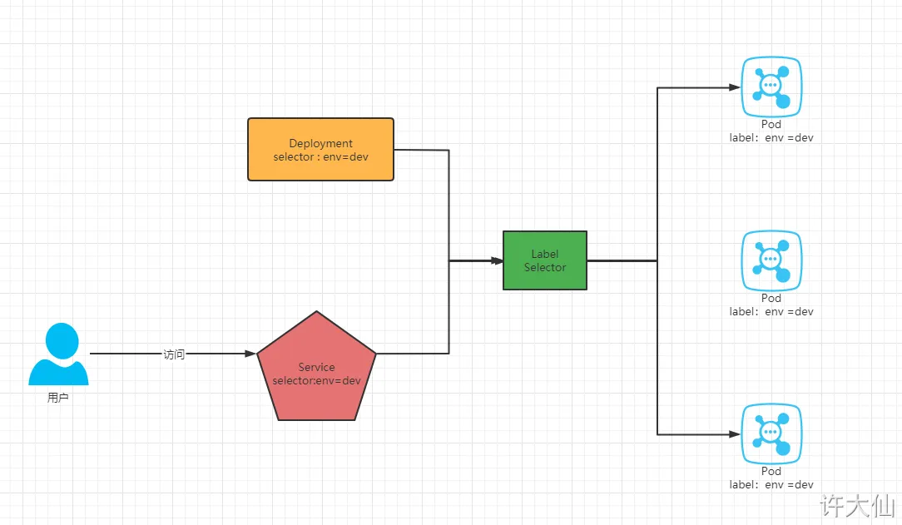
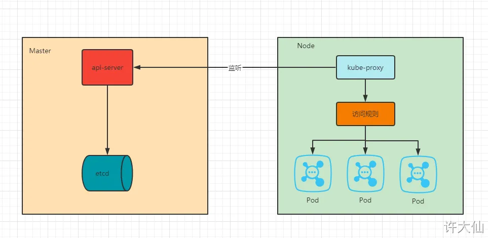
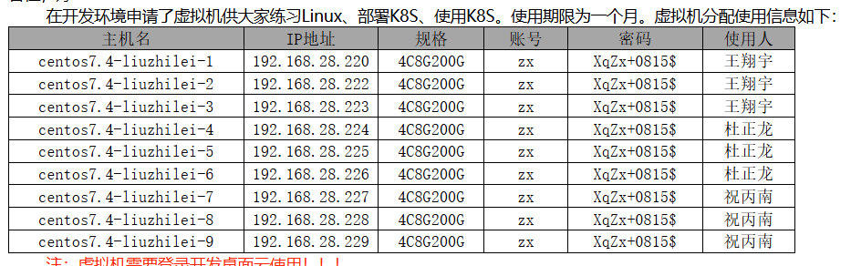

### 概念

每一个 Kubernetes 对象都包含了两个重要字段： 

- `spec`：需要由我们来提供，描述了我们对该对象所期望的 `目标状态` 。

- `status`：只能由 Kubernetes 系统来修改，描述了该对象在 Kubernetes 系统中的实际状态。

【问】：Kubernetes 是如何保证最终一致的？ 

【答】： 

-  etcd 保存的创建资源期望的状态以及最终这个资源的状态，这两种状态需要最终一致，即：spec 和 status 要最终一致。 

-  当输入 `kubectl create deployment my-nginx --image=nginx` 命令的时候，api-server 保存到 etcd ，controller-manager 会解析数据，知道集群中需要 my-nginx ，保存到 etcd 中。 

-  kubelet 在底层不停的死循环使得 spec 状态和 status 最终一致，如果 spec.replicas != status.replicas ，就启动 Pod。 

如何创建k8s对象的yaml

1. k8s中存在要创建的对象。通过`kubectl get pod xxx -o yaml > demo.yaml`直接输出yaml，然后去除status即可。
2. k8s中不存在要创建的对象。`kubectl run nginx-pod --image=nginx --dry-run=client -o yaml > demo.yaml`

当我们创建一个 Service 的时候，Kubernetes 会创建一个相应的 [DNS 条目](https://kubernetes.io/zh/docs/concepts/services-networking/dns-pod-service/)。

- 该条目的形式是`<service-name>`.`<namespace-name>`.svc.cluster.local，这意味着如果容器中只使用`<服务名称>`，它将被解析到本地名称空间的服务器。这对于跨多个名字空间（如开发、测试和生产） 使用相同的配置非常有用。如果你希望跨名字空间访问，则需要使用完全限定域名（FQDN）。

大多数的 Kubernetes 资源（如：Pod、Service、副本控制器等）都位于某些名称空间中，但是名称空间本身并不在名称空间中，而且底层资源（如：node 和持久化卷）不属于任何命名空间。

Docker中的Entrypoint、CMD ，容器中的command、args。可能的组合：Entrypoint + CMD，command+args，Entrypoint+args，command

pod：pod控制里面的容器的创建、重启等。pod不能自己恢复自己。pod内作为服务的主容器，其他是sidecar容器，还有一个pause容器控制网络和命名空间。

deployment
kubetl rollout 参数 deploy xx  支持下面的选择
status 显示当前升级的状态
history 显示升级历史记录
pause 暂停版本升级过程
resume 继续已经暂停的版本升级过程
restart 重启版本升级过程
undo 回滚到上一级版本 （可以使用--to-revision回滚到指定的版本）

滚动更新的缺点：不能直接控制新老版本的存活时间；金丝雀发布可以实现这样的功能。

金丝雀发布：给新老版本创建不同的deploy，相同的app=nginx以及v=v1和v=v2。加大v=v2的pod数量.测试完成后，删除v=v1的pod。实际开发中，还需要结合 Jenkins 的 Pipeline。

StatefulSet结合headless service：应用场景中间件


Service CIDR、Pod CIDR

Calico、公网的LoadBalancer



Service的工作：



- Service 在很多情况下只是一个概念，真正起作用的其实是 **kube-proxy** 服务进程，每个 Node 节点上都运行了一个 kube-proxy 的服务进程。当创建 Service 的时候会通过 **API Server** 向 **etcd** 写入创建的 Service 的信息，而 kube-proxy 会基于监听的机制发现这种 Service 的变化，然后它会将**最新的 Service 信息转换为对应的访问规则**（其实，就是 EndPoint，后面讲）。



- spec.type 的说明： 

  - ClusterIP（默认值）：通过集群的**内部 IP** 暴露服务，选择该值时服务只能够在集群内部访问。

  - NodePort：通过每个节点上的 IP 和静态端口（NodePort）暴露服务。 NodePort 服务会路由到自动创建的 ClusterIP 服务。 通过请求 `<节点 IP>:<节点端口>`，我们可以从集群的外部访问一个 NodePort 服务。

  - LoadBalancer：使用云提供商的负载均衡器向外部暴露服务。 外部负载均衡器可以将流量路由到自动创建的 NodePort 服务和 ClusterIP 服务上。

  - ExternalName：通过返回 CNAME 和对应值，可以将服务映射到 externalName 字段的内容（如：foo.bar.example.com）。 无需创建任何类型代理。

当创建一个 NodePort 服务时，Kubernetes 会自动生成一个 ClusterIP 服务。外部流量通过节点的 NodePort 进入，Kubernetes 的 kube-proxy 会将这个流量路由到对应的 ClusterIP。ClusterIP 会将流量负载均衡地转发到后端的 Pods。

NodePort 服务是依赖于 ClusterIP 服务来完成流量转发的，ClusterIP 服务作为中间层，确保流量能够正确地传递到后端的 Pods

> 假设创建了一个 NodePort 服务，该服务的 NodePort 是 30001，ClusterIP 是 10.96.0.1，服务的目标 Pods 在端口 8080 上监听。
>
> 当你通过集群外部访问 NodeIP:30001 时，流量会先到达这个节点的 NodePort。
> 然后，NodePort 会将流量路由到 10.96.0.1 (ClusterIP)。
> 最终，ClusterIP 将流量转发到在 8080 端口上运行的后端 Pods。
> 这样，NodePort 服务实际上是通过 ClusterIP 服务来实现对后端 Pods 的访问和负载均衡。

- OSI 网络模型和 TCP/IP 协议：

> - selector 只有在 Service 的 spec.type 是 ClusterIP、NodePort、LoadBalancer 才有效。


### 安全

1.Authentication 2.Authorization 3.Admission Control

认证，授权，准入控制

1. k8s的认证方式：HTTP Base 、HTTP Token 、HTTPS证书认证。允许同时配置多种认证，任意一种方式通过即可。

2. k8s的授权策略：AlwaysDeny、AlwaysAllow、ABAC、Webhook、Node、RBAC

​	RBAC：顶级资源对象Role、ClusterRole、RoleBinding、ClusterRoleBinding。有些资源对象不是namespace，如node、PV。

​	对象：User、Group、ServiceAccount

​	角色：定义在资源上的可操作的动作(权限)的集合 Role、ClusterRole

​	绑定：将定义好的角色和用户绑定在一起，也可以理解为分配角色 RoleBinding、ClusterRoleBinding

3. 准入控制：准入控制是一个可配置的控制器列表，可以通过在 API Server 上通过命令行设置选择执行哪些注入控制器

   ```sh
   --enable-admission-plugins=NamespaceLifecycle,LimitRanger,ServiceAccount,PersistentVolumeLabel,DefaultStorageClass,ResourceQuota,DefaultTolerationSeconds
   ```

### 资源分配和调度

   对每个命名空间的资源进行限制：ResourceQuota。可以限制的有：计算资源(cpu,memory)、扩展资源(gpu)、存储资源(PVC)、对象数量(configmap、pod等的数量)

```yaml
apiVersion: v1
kind: ResourceQuota
metadata:
  name: mem-cpu
  namespace: default # 限制 default 名称空间
spec:
  hard:
    requests.cpu: "1"
    requests.memory: 1Gi
    limits.cpu: "2"
    limits.memory: 2Gi
```

对一个pod或container进行资源限制：LimitRange

```yaml
apiVersion: v1
kind: LimitRange
metadata:
  name: cpu-min-max-demo-lr
  namespace: default # 限制 default 命名空间
spec:
  limits:
  - max:
      cpu: "800m"
    min:
      cpu: "200m" # Pod 中的容器的 cpu 的范围是 200m~800m
    type: Container
```

调度原理：pod调度到哪一个Node上。

调度类型：自动调度 Scheduler 、定向调度 NodeName  NodeSelector、亲和性调度 NodeAffinity  PodAffinity PodAntiAffinity、污点(容忍)调度 Taints  Toleration

定向调度：在pod的spec中设置nodeName: 、

```yaml
spec:
  nodeName: k8s-node1 # 指定调度到k8s-node1节点上 
  nodeSelector:
    nodeevn: pro # 指定调度到 nodeevn = pro 标签的 Node 节点上
```

亲和性调度：

>  关于亲和性和反亲和性的使用场景的说明：
>
> -  亲和性：如果两个应用频繁交互，那么就有必要利用亲和性让两个应用尽可能的靠近，这样可以较少因网络通信而带来的性能损耗。 
>
> -  反亲和性：当应用采用多副本部署的时候，那么就有必要利用反亲和性让各个应用实例打散分布在各个 Node 上，这样可以提高服务的高可用性。

nodeAffinity :比nodeSelector 增加了 In、NotIn、Exists、DoesNotExist、Gt、Lt。支持硬性过滤【多条件之间的逻辑或运算】和软性评分【设置条件权重】

```yaml
pod.spec.affinity.nodeAffinity
  requiredDuringSchedulingIgnoredDuringExecution  # Node节点必须满足指定的所有规则才可以调度，硬性过滤
    nodeSelectorTerms  # 节点选择列表 ## 满足其中一个就能满足
      matchFields   # 按节点字段列出的节点选择器要求列表  
      # matchFields 和matchExpressions 二选一 # 要满足节点选择器的所有要求
      matchExpressions   # 按节点标签列出的节点选择器要求列表(推荐)
        key    # 键
        values # 值
        operator # 关系符 支持Exists, DoesNotExist, In, NotIn, Gt, Lt
  preferredDuringSchedulingIgnoredDuringExecution # 优先调度到满足指定的规则的Node，软性评分 (倾向)   
    preference   # 一个节点选择器项，与相应的权重相关联
      matchFields # 按节点字段列出的节点选择器要求列表
      # matchFields 和 matchExpressions 二选一
      matchExpressions   # 按节点标签列出的节点选择器要求列表(推荐)
        key # 键
        values # 值
        operator # 关系符 支持In, NotIn, Exists, DoesNotExist, Gt, Lt  
    weight # 倾向权重，在范围1-100。
```

当 `nodeAffinity` 同时定义了硬过滤和软过滤时，调度器会先评估硬过滤条件，筛选出所有满足硬过滤条件的节点。在这些节点中，调度器再根据软过滤条件的权重选择最优的节点来调度 Pod。

podAffinity和podAntiAffinity：

```yaml
pod.spec.affinity.podAffinity
  requiredDuringSchedulingIgnoredDuringExecution  # 硬限制
    namespaces # 指定参照pod的namespace
    topologyKey # 指定调度作用域 ● 如果指定为 kubernetes.io/hostname（可以通过 kubectl get node --show-labels 查看），那就是以 Node 节点为区分范围。 ●  如果指定为 kubernetes.io/os，则以 Node 节点的操作系统类型来区分。 
    labelSelector # 标签选择器
      matchExpressions  # 按节点标签列出的pod选择器要求列表(推荐)
        key    键
        values 值
        operator 关系符 支持In, NotIn, Exists, DoesNotExist.
      matchLabels    # 指多个matchExpressions映射的内容  
  preferredDuringSchedulingIgnoredDuringExecution 软限制    
    podAffinityTerm  选项
      namespaces
      topologyKey
      labelSelector
         matchExpressions 
            key    键  
            values 值  
            operator
         matchLabels 
    weight 倾向权重，在范围1-100
```


### 分配虚拟机：



配置192.168.28.220 虚拟机，账号: zx 。密码: XqZx+0815$

 1. 关闭防火墙

    ```yaml
    [root@master01 ~]# systemctl stop firewalld
    [root@master01 ~]# systemctl disable firewalld
    [root@master01 ~]# systemctl is-enabled firewalld
    ```

 2. 关闭selinux

    ```yaml
    [root@master01 ~]# sed -i "s/SELINUX=enforcing/SELINUX=disabled/g" /etc/selinux/config
    [root@master01 ~]# setenforce 0
    ```

 3. 关闭swap分区

    ```sh
    [root@master01 ~]# sed -i '/swap/s/^/#/g' /etc/fstab
    [root@master01 ~]# swapoff -a  
    ```

 4. 配置host

    ```sh
    [root@master01 ~]# cat >>/etc/host <<EOF
    192.168.96.101 master01
    192.168.96.104 node01
    192.168.96.105 node02
    192.168.96.106 node03
    EOF
    ```

 5. 更新yum版本

    ```
    [root@master01 ~]# yum update -y  # 网络不佳的情况下不要执行
    ```
 6. 清除配置
    ```
    iptables -F && iptables -t nat -F && iptables -t mangle -F && iptables -X
    ```

for i in $(ls /usr/lib/modules/$(uname -r)/kernel/net/netfilter/ipvs|grep -o "^[^.]*");do echo $i; /sbin/modinfo -F filename $i >/dev/null 2>&1 && /sbin/modprobe $i;done

1. net.bridge.bridge-nf-call-ip6tables=1
2. net.bridge.bridge-nf-call-iptables=1
3. net.ipv6.conf.all.disable_ipv6=1
4. net.ipv4.ip_forward=1
