#### 污点和容忍

污点调度： 在Node的角度，通过在Node上添加 污点属性，来决定是否运行Pod调度过来。设置了污点之后就和Pod之间存在互斥关系，拒绝Pod调度过来，甚至可以将已存在的Pod驱逐出去。

```sh
key=value:effect
# key 和 value 是污点的标签及对应的值
# effect 描述污点的作用
```

- effect 支持如下的三个选项： 

  - PreferNoSchedule：Kubernetes 将尽量避免把 Pod 调度到具有该污点的 Node 上，除非没有其他节点可以调度；换言之，尽量不要来，除非没办法。

  - NoSchedule：Kubernets 将不会把 Pod 调度到具有该污点的 Node 上，但是不会影响当前 Node 上已经存在的 Pod ;换言之，新的不要来，在这的就不要动。

  - NoExecute：Kubernets 将不会将 Pod 调度到具有该污点的 Node 上，同时会将 Node 上已经存在的 Pod 驱逐；换言之，新的不要来，这里的赶紧走。

NoExecute 一般用于实际生产环境中的Node节点的上下线。

```sh
# 设置污点
kubectl taint node xxx key=value:effect
# 去除污点
kubectl taint node xxx key:effect-
# 去除所有污点
kubectl taint node xxx key-
# 查看污点
kubectl describe node xxx | grep -i taints
```

容忍调度：让一个pod调度到一个有污点的Node上，污点是拒绝，容忍是忽略。node通过污点拒绝pod调度上去，pod通过容忍忽略拒绝。

```sh
kubectl explain pod.spec.tolerations
......
FIELDS:
  key       # 对应着要容忍的污点的键，空意味着匹配所有的键
  value     # 对应着要容忍的污点的值
  operator  # key-value的运算符，支持Equal（默认）和Exists
  effect    # 对应污点的effect，空意味着匹配所有影响PreferNoSchedule、NoSchedule、 NoExecute
  tolerationSeconds   # 容忍时间, 当effect为NoExecute时生效，表示pod在Node上的停留时间
```

容忍中没有定义key，定义operator为Exits，Kubernetes认为容忍所有的污点
```yml
tolerations:
- operator: Exists
# 最终，所有有污点的机器我们都能容忍，Pod 都可以调度。
```
没有定义effect 但是定义了key，k8s认为此容忍匹配所有effect。
```yaml
  tolerations: # 容忍
    - key: "tag" # 要容忍的污点的key
      operator: Exists # 操作符
# 最终，有这个污点的机器我们可以容忍，Pod 都可以调度。
```

练习：

#### 了解平台

>  基础云平台：需掌握基础云平台组成结构、各平台定位及功能特点，突出讲解**容器相关的容器云、云边[kubeEdge]、混部、**[多媒体智能交互云系统 IVR](https://www.kdocs.cn/l/ckDBEvKEcDkb)及未来发展
>
> 容器云平台：需掌握容器云平台的功能架构、技术架构、集群部署、功能组件、镜像仓库、观云台等内容。
>

容器云，云边，混部，多媒体智能交互云系统

从**harbor** pull镜像

HAProxy is a free, very fast and reliable reverse-proxy offering [high availability](http://en.wikipedia.org/wiki/High_availability), [load balancing](http://en.wikipedia.org/wiki/Load_balancer), and proxying for TCP and HTTP-based applications. It is particularly suited for very high traffic web sites and powers a significant portion of the world's most visited ones. Over the years it has become the de-facto standard opensource load balancer, is now shipped with most mainstream Linux distributions, and is often deployed by default in cloud platforms. Since it does not advertise itself, we only know it's used when the [admins report it](https://www.haproxy.org/they-use-it.html) :-)

HAProxy 是一个免费、非常快速和可靠的反向代理产品提供高可用性， 负载均衡，以及用于 TCP 和基于 HTTP 的应用程序的代理。它特别适合非常高流量的网站，并为世界上访问量最大的网站的很大一部分提供支持。 多年来，它已经成为事实上的标准开源负载均衡器，现在随大多数主流 Linux 发行版一起提供，并且通常由 在云平台中默认。

keepalived:健康检查、失败切换

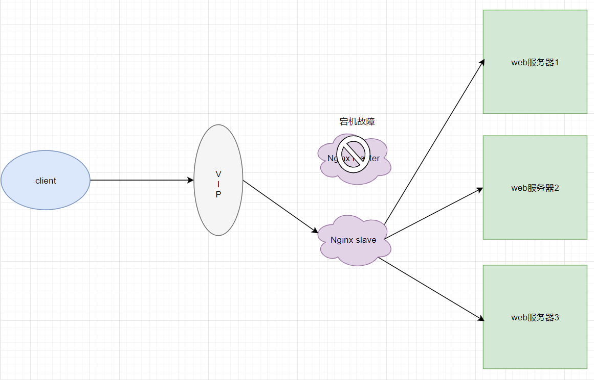


### 云平台架构

技术架构：

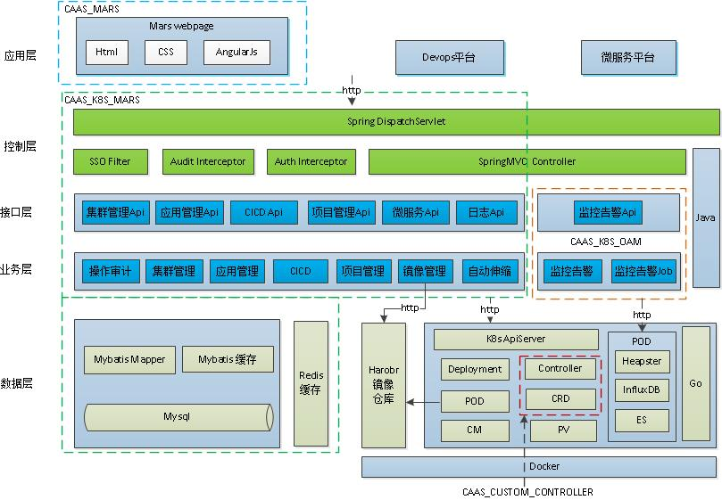

功能架构

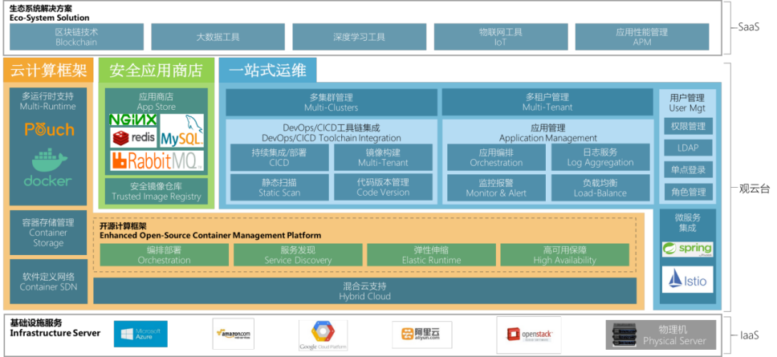

核心功能介绍：多集群管理、多租户管理、CI/CD工具链、中间件管理、安全镜像仓库、弹性伸缩服务

应用和服务管理、配置中心、用户管理、系统设置

基础功能介绍：平台日志服务、监控报警服务、存储管理、负载均衡服务、容器管理、智能调度服务、

服务注册与发现、网络管理。

## 容器云平台一期

> 2018年完成容器云一期项目建设，初步构建应用快速部署、资源弹性伸缩、便捷运维等核心能力；在洛阳、淮安的核心域和互联网域分别构建了2套高可用生产集群，支撑业务的跨中心容器化部署，保障集群冗余性和业务连续性；在淮安测试环境分别搭建了1套开发和测试集群，实现开发、测试和生产的CI/CD无缝连接，提升持续交付效率；优化资源使用效率，有效提升资源分配比和资源利用率

共有**6套业务集群**，通过观云台实现跨集群管理。

核心生产集群和互联网生产集群 在洛阳数据中心和淮安数据中心各有两个集群。支撑业务的跨中心容器化部署。 这四个集群是高可用集群 HA
淮安的开发测试环境 搭建了核心 开发集群和一个测试集群。

观云台-HA对多集群进行统一的可视化管理，提供多集群的注册、修改、运维、监控等核心功能支持，实现开发、测试、生产集群的一站式管理
搭建分布式存储，满足集群应用 的数据持久化

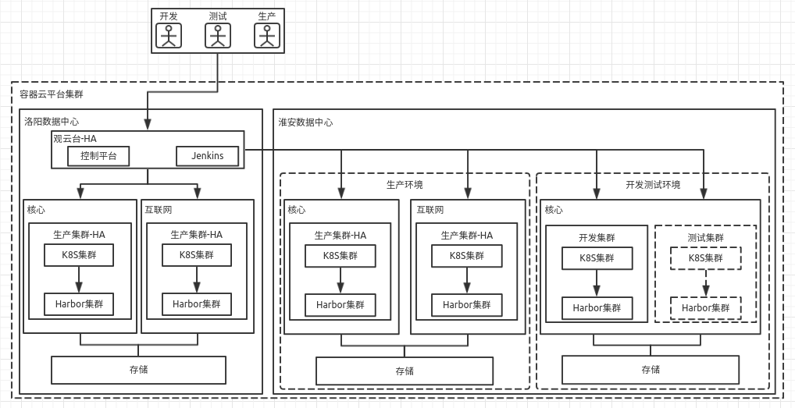

观云台集成到研发云系统，通过单点登陆实现系统间用户的统一认证。

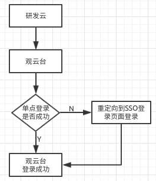

统一部署：
在容器云平台中增加业务集群，为分公司提供资源，并通过观云台统一管理。借助租户实现不同分公司之间的隔离，做到对分公司业务的统一支撑。
独立部署：(**云边协同**)
针对一些部署规模比较大的业务，需在各分公司**独立搭建K8S集群**，并通过总部观云台实现统一纳管。该方案**管理简单**，但需要考虑跨地域管理的网络延迟。

观云台的功能架构：

* 多租户管理：租户间的资源隔离和网络隔离，不同租户之间可实现逻辑和物理两种方式的隔离。
* 资源管理框架：编排部署、服务发现、弹性伸缩，高可用保证等服务
* DevOps：提供
* 灵活的微服务架构
* 通用中间件服务

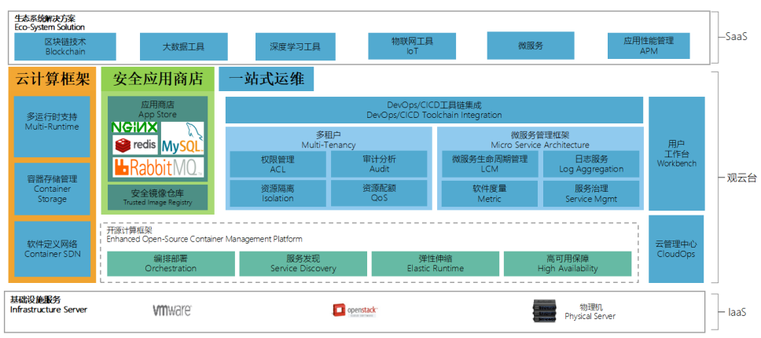

#### 高可用方案
Master高可用集群架构图：高可用->三台master

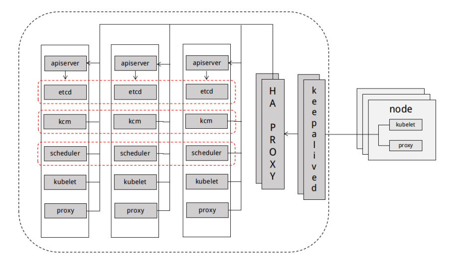

观云台 前端webpage， 后端webapi，多pod保证高可用

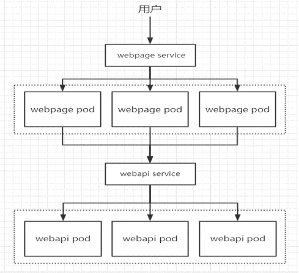

镜像仓库：多实例和一套分布式的共享存储卷系统。

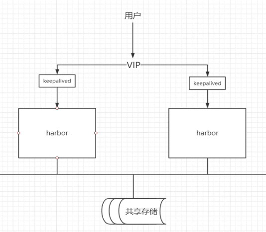

平台网络方案

#### 网络

Calico进行**三层**路由网络方案。网络层 路由协议

宿主机的**路由转发**实现不同容器间跨主机通信，为每个pod分配独立IP地址，实现pod迁移后的唯一性，2^16 -1 个IP地址。

iptables实现网络安全策略。

使用IPIP模式

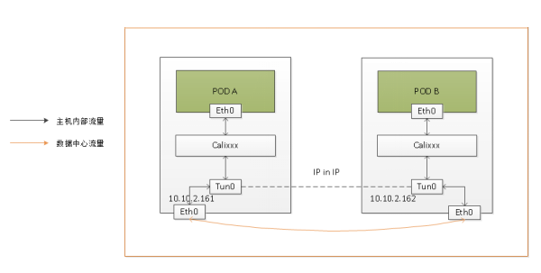

集群服务访问：

* 集群外部访问： 统一通过F5做负载均衡，转发到集群内部nginx，然后做集群内部pod负载
  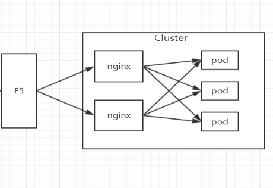
* 集群内部 访问：通过服务名称 kube-dns cluster ip podip 实现服务调用
  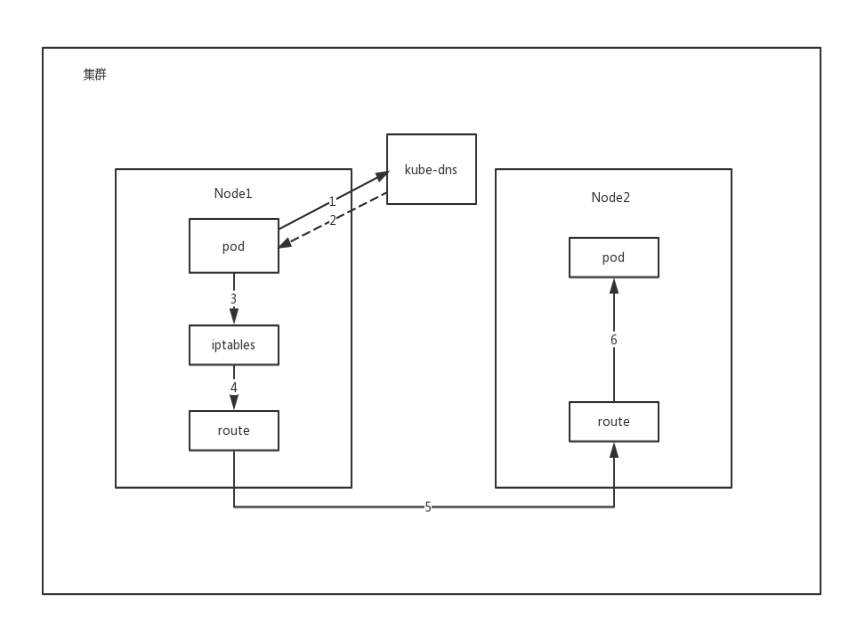
* 跨集群访问：通过F5实现内外集群**IP+端口**的映射，完成特定服务调用
  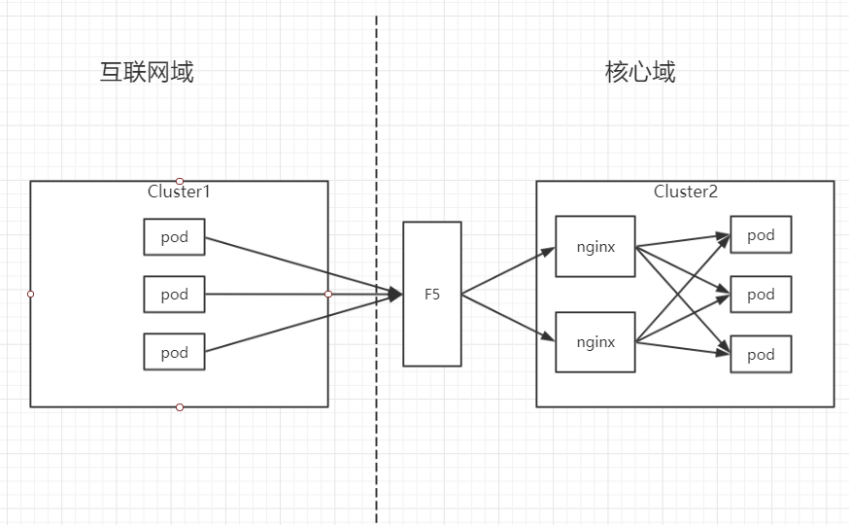

#### 存储方案

分布式文件系统作为共享存储

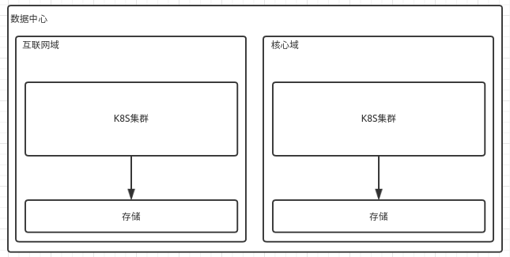

#### 平台扩展方案

集群扩展性，存储扩展性

系统节点： 提供监控、日志收集、安全性和其他运维功能。
